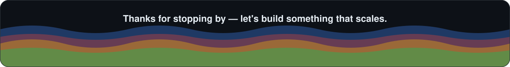

<!-- Hero -->

  

  
  
  
  

 

I'm a backend engineer at **Google** in Berlin. For 4+ years I've been building production systems that have to keep running — from industrial IoT on the factory floor at **TOFAŞ**, to enterprise software at **OpenText** in Toronto, to the web at Google.

I like boring, reliable infrastructure, clean APIs, and code the next person can actually read.

 

<!-- Journey -->

  

## Currently building

 

## Toolbox

   
  

 

## Contributions, eaten live

<picture>
  <source media="(prefers-color-scheme: dark)" srcset="https://raw.githubusercontent.com/potatoref/potatoref/output/snake-dark.svg">
  
</picture>

  

