<picture>
  <source media="(prefers-color-scheme: dark)" srcset="./assets/header-dark.svg">
  
</picture>

 

I'm a backend engineer at **Google** in Berlin. For the past 4+ years I've been building production systems that have to keep running — starting on industrial IoT at **TOFAŞ**, moving to enterprise software at **OpenText** in Toronto, and now working on the web at Google.

I care about boring, reliable infrastructure, clean APIs, and code the next person can read.

 

### Where I've been

| | Role | Where |
|:--|:--|:--|
| **Now** | Web / Backend Engineer · **Google** | Berlin, DE |
| | Web Developer · **OpenText** | Toronto, CA |
| | IT Intern · **TOFAŞ** | Bursa, TR |
| | Computer Engineering · **Uludağ University** | Bursa, TR |

 

### What I work with

  
   
  

 

### Things I've built

| Project | What it is | Stack |
|:--|:--|:--|
| [**Speech Recognition App**](https://github.com/potatoref/Speech-Recognition-Application) | Real-time transcription that counts target words and outputs subtitle-ready text | Python · Tkinter |
| [**Tetris**](https://github.com/potatoref/tetris-game) | A full Tetris clone, built to learn Dart and game loops | Dart |
| [**Discord Team Raffle Bot**](https://github.com/potatoref/discord-team-raffle-bot) | Splits a server's members into random, balanced teams | Python |

 

### Get in touch

Always happy to talk about backend architecture, Go, or moving from Bursa to Berlin.
